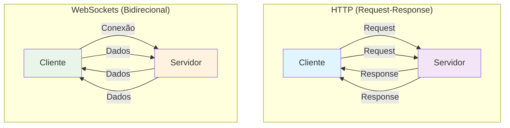
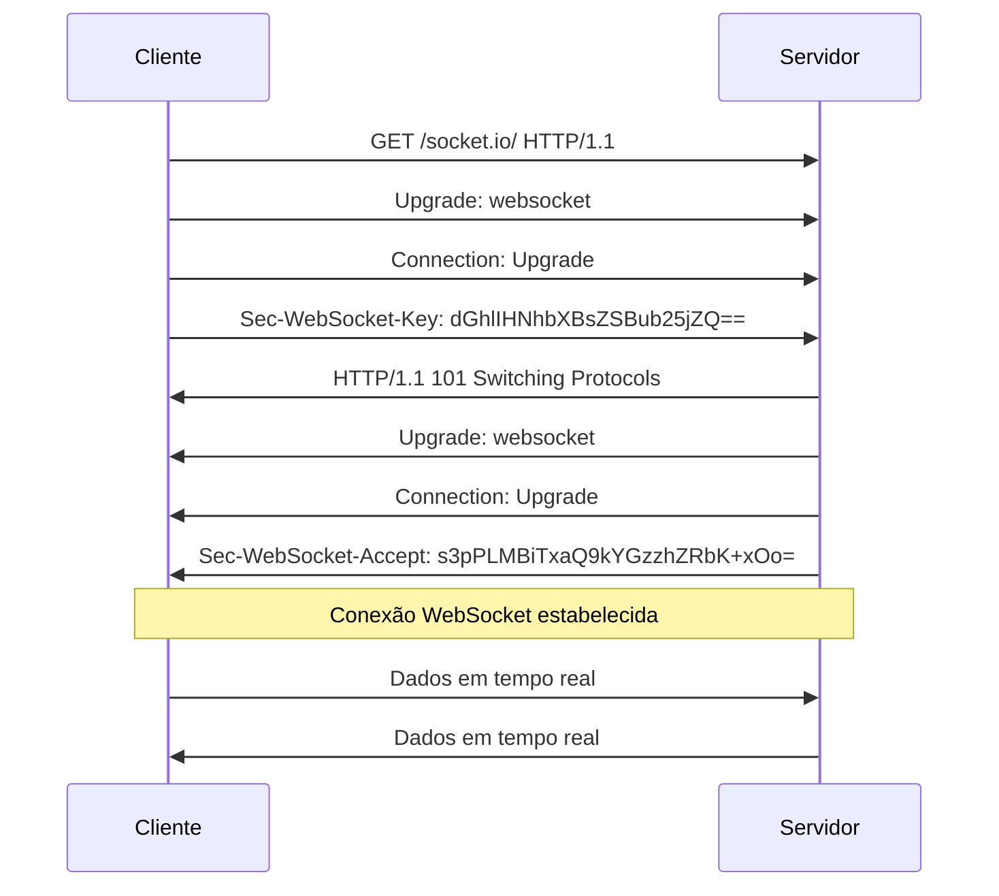
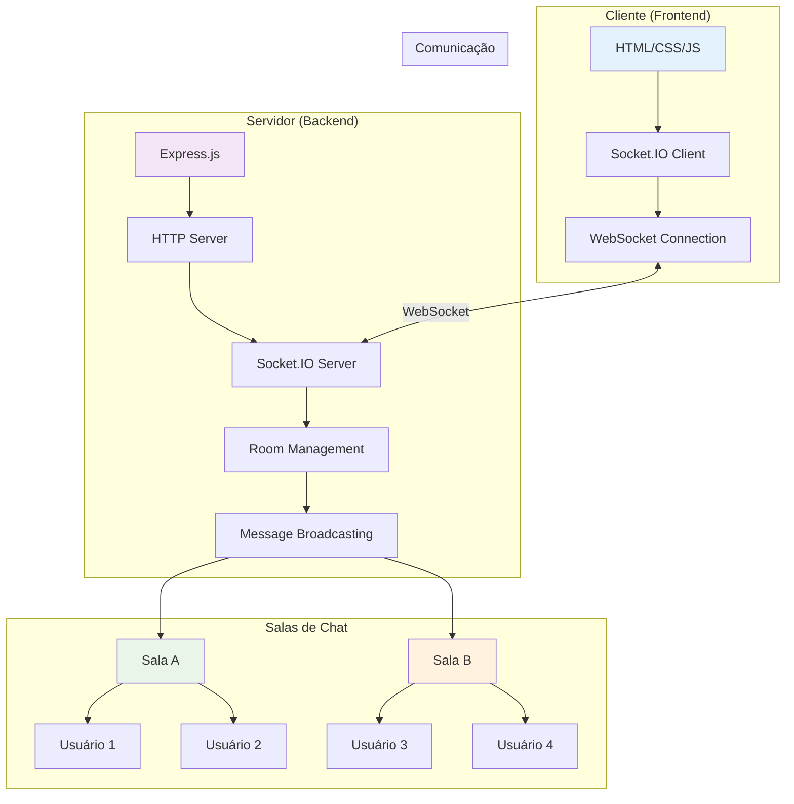
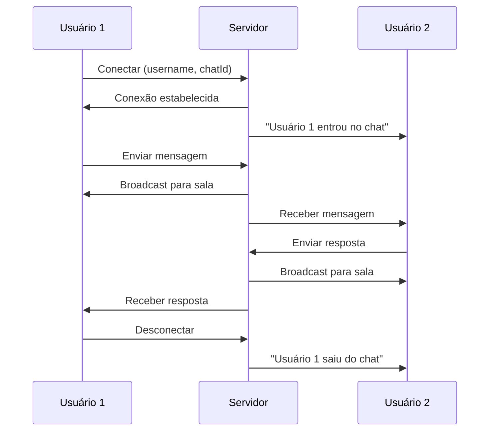
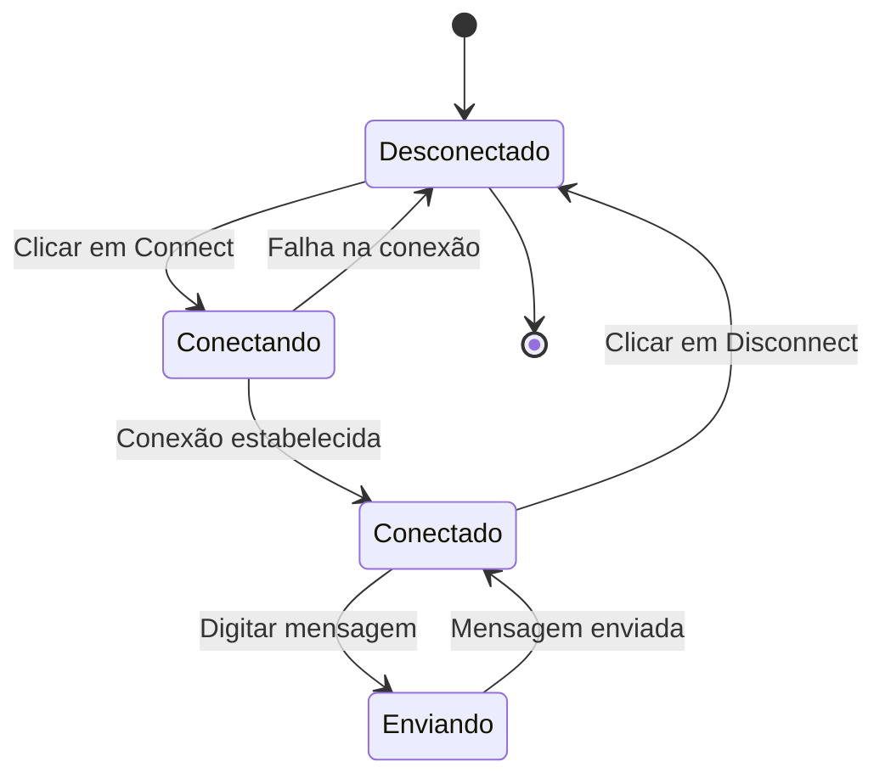
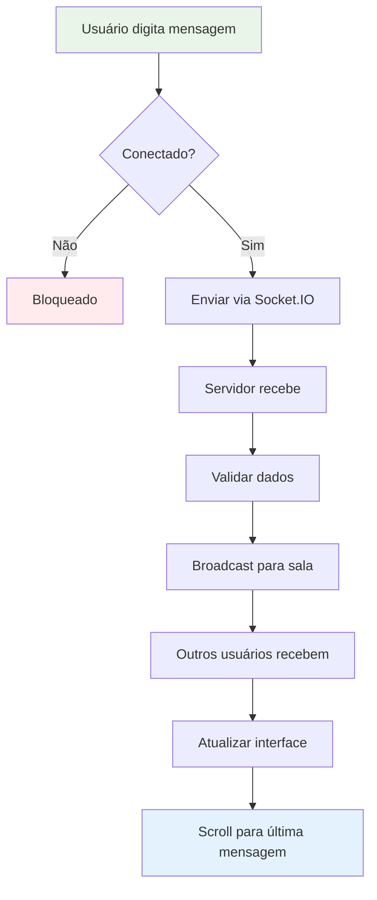

# Chat com WebSockets

## 📋 Índice

- [Visão Geral](#-visão-geral)
- [Teoria dos WebSockets](#-teoria-dos-websockets)
- [Arquitetura do Sistema](#️-arquitetura-do-sistema)
- [Tecnologias Utilizadas](#️-tecnologias-utilizadas)
- [Instalação e Configuração](#-instalação-e-configuração)
- [Estrutura do Projeto](#-estrutura-do-projeto)
- [Fluxo de Dados](#-fluxo-de-dados)
- [Conceitos Técnicos](#-conceitos-técnicos)
- [Exercícios Práticos](#-exercícios-práticos)
- [Referências](#-referências)

## 🎯 Visão Geral

Este projeto implementa um sistema de chat em tempo real utilizando **WebSockets** através da biblioteca **Socket.IO**. O objetivo é demonstrar como funciona a comunicação bidirecional entre cliente e servidor, permitindo que múltiplos usuários troquem mensagens instantaneamente em salas de chat específicas.

### Características Principais

- ✅ **Comunicação em tempo real** - Mensagens instantâneas entre usuários
- ✅ **Salas de chat** - Suporte a múltiplas salas de conversa
- ✅ **Interface responsiva** - Design moderno com Tailwind CSS
- ✅ **Notificações de sistema** - Avisos quando usuários entram/saem
- ✅ **Conexão persistente** - Manutenção da conexão WebSocket
- ✅ **Interface intuitiva** - Fácil de usar e entender

## 🔬 Teoria dos WebSockets

### O que são WebSockets?

WebSockets são um protocolo de comunicação que estabelece um **canal de comunicação bidirecional e persistente** entre um cliente (navegador) e um servidor através de uma única conexão TCP.

### Diferenças entre HTTP e WebSockets



### Vantagens dos WebSockets

1. **Baixa Latência** - Comunicação instantânea
2. **Eficiência** - Uma conexão para múltiplas mensagens
3. **Bidirecional** - Cliente e servidor podem enviar dados
4. **Persistente** - Conexão mantida até ser fechada
5. **Menos Overhead** - Headers menores após handshake inicial

### Handshake WebSocket



## 🏗️ Arquitetura do Sistema

### Diagrama de Arquitetura



### Fluxo de Comunicação



## 🛠️ Tecnologias Utilizadas

### Backend

- **Node.js** - Runtime JavaScript no servidor
- **Express.js** - Framework web para Node.js
- **Socket.IO** - Biblioteca para WebSockets em tempo real

### Frontend

- **HTML5** - Estrutura da página
- **JavaScript (ES6+)** - Lógica do cliente
- **Tailwind CSS** - Framework CSS utilitário (via CDN)

### Ferramentas de Desenvolvimento

- **Nodemon** - Reinicialização automática do servidor
- **Prettier** - Formatação de código

## 🚀 Instalação e Configuração

### Pré-requisitos

- Node.js (versão 14 ou superior)
- npm (gerenciador de pacotes do Node.js)

### Passos para Instalação

1. **Clone o repositório**

   ```bash
   git clone https://github.com/rgomide/chat-with-websockets.git
   cd chat-with-websockets
   ```

2. **Instale as dependências**

   ```bash
   npm install
   ```

3. **Inicie o servidor**

   ```bash
   npm start
   ```

4. **Acesse a aplicação**
   - Abra o navegador
   - Acesse: `http://localhost:3000`

## 📖 Como Usar

### 1. Conectando ao Chat

1. **Digite seu nome de usuário** no campo "Username"
2. **Digite um ID de chat** no campo "Chat ID" (ex: "sala1", "turma2024")
3. **Clique em "Connect"** para estabelecer a conexão

### 2. Enviando Mensagens

1. **Aguarde a conexão** ser estabelecida (status: "Connected")
2. **Digite sua mensagem** no campo de texto
3. **Pressione Enter** ou clique em "Send"

### 3. Participando de Salas

- **Mesmo Chat ID** = Mesma sala de conversa
- **Chat IDs diferentes** = Salas separadas
- **Usuários na mesma sala** recebem todas as mensagens

### 4. Desconectando

- **Clique em "Disconnect"** para sair do chat
- **Outros usuários** serão notificados da sua saída

## 📁 Estrutura do Projeto

```
chat-with-websockets/
├── 📄 package.json           # Dependências e scripts
├── 📄 README.md             # Documentação
├── 📁 public/               # Arquivos estáticos
│   └── 📄 index.html        # Interface do usuário
└── 📁 src/                  # Código fonte
    └── 📄 index.js          # Servidor Express + Socket.IO
```

### Detalhamento dos Arquivos

#### `src/index.js` - Servidor Principal

- Configuração do Express.js
- Inicialização do Socket.IO
- Gerenciamento de conexões e salas
- Broadcasting de mensagens

#### `public/index.html` - Interface do Cliente

- Interface responsiva com Tailwind CSS
- Lógica JavaScript para WebSockets
- Gerenciamento de estado da conexão
- Renderização de mensagens

## 🔄 Fluxo de Dados

### Diagrama de Estados



### Fluxo de Mensagens



## 🎓 Conceitos Técnicos

### Socket.IO vs WebSockets Nativo

**Socket.IO** é uma biblioteca que:

- Fornece **fallback automático** para HTTP long-polling
- Oferece **reconexão automática**
- Suporta **rooms e namespaces**
- Tem **API mais simples** que WebSockets nativo

### Gerenciamento de Salas

```javascript
// Entrar em uma sala
socket.join(chatId)

// Enviar para uma sala específica
io.to(chatId).emit('message', data)

// Enviar para todos exceto o remetente
socket.to(chatId).emit('message', data)
```

### Eventos Socket.IO

| Evento       | Descrição                 | Direção            |
| ------------ | ------------------------- | ------------------ |
| `connection` | Nova conexão estabelecida | Servidor           |
| `disconnect` | Conexão fechada           | Servidor           |
| `join`       | Usuário entra em sala     | Cliente → Servidor |
| `message`    | Nova mensagem             | Bidirecional       |

### Estrutura de Dados

#### Mensagem

```javascript
{
  username: "João Silva",
  message: "Olá, pessoal!",
  timestamp: "2024-01-15T10:30:00.000Z"
}
```

#### Dados de Conexão

```javascript
{
  username: "João Silva",
  chatId: "sala1"
}
```

## 🎯 Exercícios Práticos

### Exercício 1: Implementar Notificações

**Objetivo**: Adicionar notificações sonoras quando novas mensagens chegam.

**Passos**:

1. Adicionar elemento `<audio>` no HTML
2. Implementar função para tocar som
3. Chamar função quando nova mensagem chegar

### Exercício 2: Histórico de Mensagens

**Objetivo**: Persistir mensagens em memória do servidor.

**Passos**:

1. Criar array para armazenar mensagens
2. Salvar mensagens quando recebidas
3. Enviar histórico ao conectar

### Exercício 3: Lista de Usuários Online

**Objetivo**: Mostrar quem está conectado na sala.

**Passos**:

1. Manter lista de usuários por sala
2. Emitir lista quando usuário conectar/desconectar
3. Atualizar interface com lista

### Exercício 4: Mensagens Privadas

**Objetivo**: Permitir mensagens diretas entre usuários.

**Passos**:

1. Implementar comando `/msg @usuario`
2. Criar lógica para mensagens privadas
3. Atualizar interface para mostrar mensagens privadas

## 📚 Referências

### Documentação Oficial

- [Socket.IO Documentation](https://socket.io/docs/)
- [Express.js Documentation](https://expressjs.com/)
- [Node.js Documentation](https://nodejs.org/docs/)

### Tutoriais Recomendados

- [Socket.IO Getting Started](https://socket.io/get-started/chat)
- [WebSockets vs HTTP](https://developer.mozilla.org/en-US/docs/Web/API/WebSockets_API)
